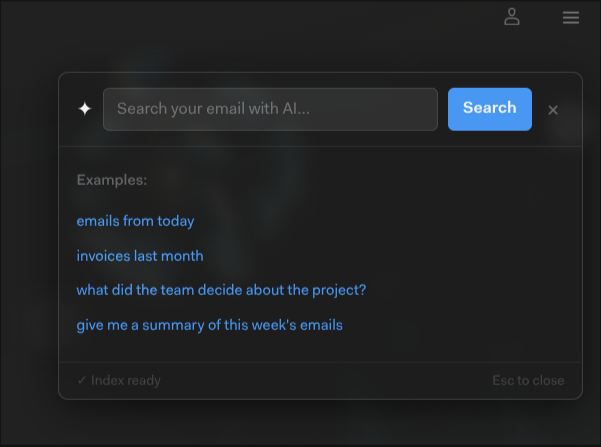
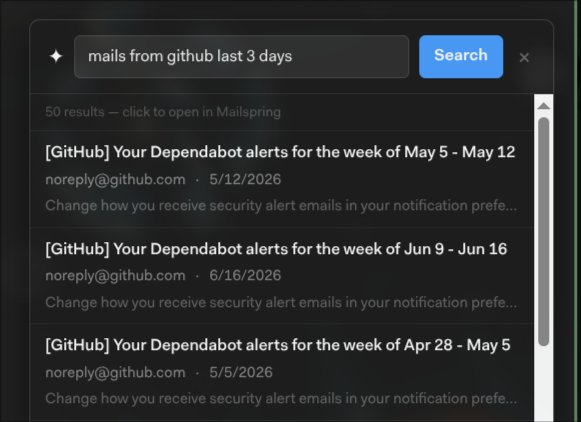
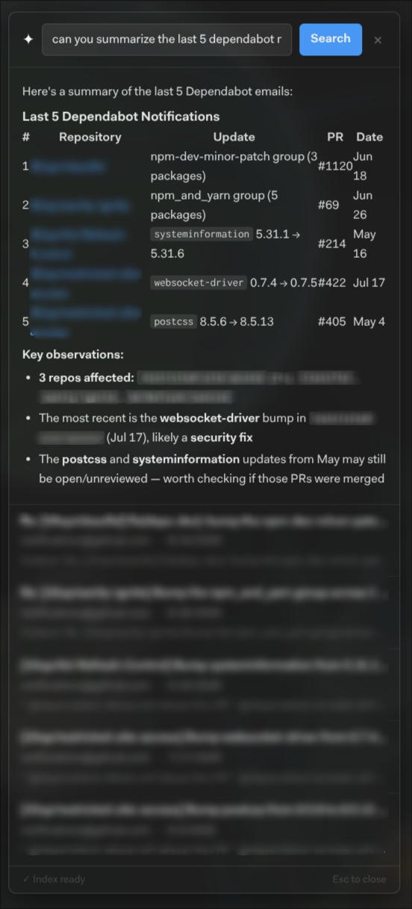
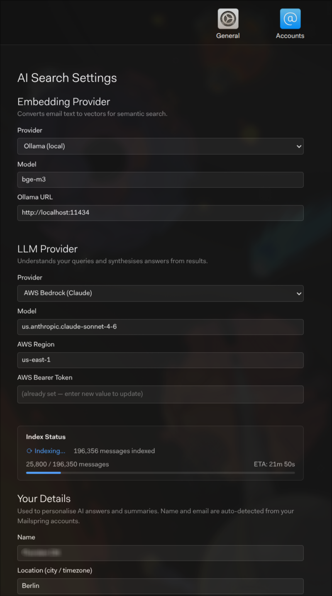

# mailspring-ai-search

> **⚠️ Early Development — Proof of Concept**
>
> This plugin is in early development and has received limited testing. APIs, configuration formats, and behaviour are subject to change without notice. It is published to demonstrate the approach and invite collaboration — not for production use. Expect rough edges, bugs, and breaking changes.
>
> Contributions, issues, and feedback are welcome.

AI-powered semantic search for [Mailspring](https://getmailspring.com) — bringing vector embeddings, LLM query understanding, and conversational email search directly into your mail client.

## Features

- **Semantic search** — find emails by meaning, not just keywords ("what did the team say about the budget?" works)
- **LLM query understanding** — natural language queries are parsed into precise database filters + semantic search
- **Structured answers** — get a synthesised answer with citations rather than just a list of emails
- **Configurable providers** — bring your own embedding and LLM provider (OpenAI, Anthropic, AWS Bedrock, Ollama, or local ONNX)
- **Privacy-first** — all data stays local in LanceDB; only text sent to your configured provider
- **Zero re-fetching** — reads directly from Mailspring's local database, no IMAP needed

## Screenshots

<table>
  <tr>
    <td align="center" width="50%">
      <br/>
      <em>Search panel — opens from the toolbar button</em>
    </td>
    <td align="center" width="50%">
      <br/>
      <em>Filter queries return instant results</em>
    </td>
  </tr>
  <tr>
    <td align="center" width="50%">
      <br/>
      <em>LLM synthesises structured answers with citations</em>
    </td>
    <td align="center" width="50%">
      <br/>
      <em>Configure embedding and LLM providers in Preferences</em>
    </td>
  </tr>
</table>

## Architecture

```
Mailspring (Electron)
  └── mailspring-ai-search (plugin)
        ├── Indexer: reads from Mailspring's SQLite DB → chunks → embeds → LanceDB
        ├── SearchEngine: LLM generates query plan → LanceDB hybrid search → LLM synthesis
        └── UI: search bar + settings panel injected into Mailspring's toolbar/preferences
```

## Supported Providers

### Embeddings
| Provider | Model | Notes |
|---|---|---|
| **Local ONNX** | `Xenova/bge-base-en-v1.5` | Default. No API key, works offline. Uses `@huggingface/transformers` WASM. |
| **Ollama** | `nomic-embed-text`, `bge-m3`, etc. | Local GPU/CPU via Ollama daemon. |
| **OpenAI** | `text-embedding-3-small/large` | Requires API key. |
| **AWS Bedrock** | `amazon.titan-embed-text-v2:0` | Supports bearer token (AWS SSO) or IAM. |

### LLM (query planning + synthesis)
| Provider | Models | Notes |
|---|---|---|
| **Ollama** | `llama3.2`, `qwen2.5:3b`, etc. | Default. Local, offline. |
| **Anthropic** | `claude-haiku-4-5`, `claude-sonnet-5` | Requires API key. |
| **AWS Bedrock** | `us.anthropic.claude-sonnet-4-6` | Bearer token or IAM. |
| **OpenAI** | `gpt-4o-mini`, `gpt-4o` | Requires API key. |

## Installation

```bash
# Clone into Mailspring packages directory
cd ~/.config/Mailspring/packages
git clone https://github.com/tott/mailspring-ai-search
cd mailspring-ai-search
npm install
npm run build
```

Then restart Mailspring. The plugin will appear in Preferences → AI Search.

## Configuration

Open Mailspring → Preferences → AI Search to configure:
1. **Embedding provider** — choose your embedding backend and enter credentials
2. **LLM provider** — choose your LLM backend and enter credentials

Credentials are stored in Mailspring's config store (`~/.config/Mailspring/config.json`), separate from general plugin settings. This file is only readable by the local user. Environment variables (`OPENAI_API_KEY`, etc.) take precedence and are recommended for shared/CI environments.

### AWS Bedrock (bearer token)

If your organization uses AWS SSO with bearer tokens:
1. Set `AWS_BEARER_TOKEN_BEDROCK` environment variable, or
2. Enter the token in Preferences → AI Search

### Environment variables (development)

| Variable | Purpose |
|---|---|
| `OPENAI_API_KEY` | OpenAI API key |
| `ANTHROPIC_API_KEY` | Anthropic API key |
| `AWS_BEARER_TOKEN_BEDROCK` | AWS Bedrock bearer token |
| `AWS_ACCESS_KEY_ID` / `AWS_SECRET_ACCESS_KEY` | AWS IAM credentials |

## Development

```bash
npm install
npm run watch    # TypeScript watch mode
```

Load from Mailspring: Edit menu → Install a Plugin → select this directory.

## License

MIT
